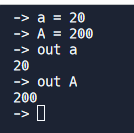

# Charr Lang
version: 0.0.1

(Early development)

---


# Running the language:
You can give the CharrLang shell a test run for the syntax basics by visting this link:
https://replit.com/@charlotte-2222/charr-lang?v=1

If you wish to run the language on your own machine, you are welcome to clone/or fork the repository.
At the moment Charr is not ready for extended use, but it is capable of running .charr files to some extent.


# General Syntax:

Writing Hello World is fairly easy. 
`out="Hello, World!`<br>
One could also write:


## Data Types
#### List/Arrays
List/Array(s) contains of elements of the same type (either int, float, string, bool).

They can be created using the following syntax:

```
var = [1, 2, 3, 4, 5]
```

## Variables
These objects are used to store data.

### Creating a variable
Charr does not declare explicit variables, variables are created when they are assigned to.

```
var = 1
foo = "bar"
```

#### Case Sensitivity
Charr variables are case sensitive.



#### Comments
Charr supports comments, which are lines starting with a `//` character.

```
// This is a comment
```

## Operations, Logic Operators, and Assignment Operators
### Arithmetic Operators
Charr supports the following arithmetic operators:

| Operator |Name|  Example  |
|:---------|:---|:---------:|
| `+`      |Addition|  `1 + 1`  |
| `-`      |Subtraction|  `1 - 1`  |
| `*`      |Multiplication|  `1 * 1`  |
| `/`      |Division|  `1 / 1`  |
| `%`      |Modulus|  `1 % 1`  |
| `^`      |Exponent|   `x^y`   |
| `inc`    |Increment| `inc val` |
| `dec`    |Decrement| `dec val` |

### Logical Operators
Charr supports the following logical operators:

| Operator |Name|  Example  |
|:---------|:---|:---------:|
|`==`|Equality|`1 == 1`|
|`!=`|Inequality|`1 != 1`|
|`<`|Less than|`1 < 2`|
|`>`|Greater than|`1 > 2`|
|`<=`|Less than or equal to|`1 <= 2`|
|`>=`|Greater than or equal to|`1 >= 2`|

### Assignment Operators
The assignment operator `=` is used to assign a value to a variable.

## If Statements
Charr supports if statements.

```
if (condition) {
    // code to execute if condition is true
}
else{
    // code to execute if condition is false
}
```

Example:

```
 if counter % 5 == 0
            { output "Buzz" }
        else
            { output counter }
```

## While Do Loops

With the while loop, we can execute a block of code as long as a condition is true.

```
while condition 
do{
    // code to execute
}
```

#### Example

```
precision = 100000
total = 0
counter = 0

while counter < precision
do {
    odd = (2 * counter + 1)
    if (counter % 2 == 0)
        { total = total + 1/odd }
    else
        { total = total - 1/odd }
    inc counter
}

pi = 4 * total
output pi
```


# That's all for the time being.


Author: Charlotte Childers
Date: 2022-08-03